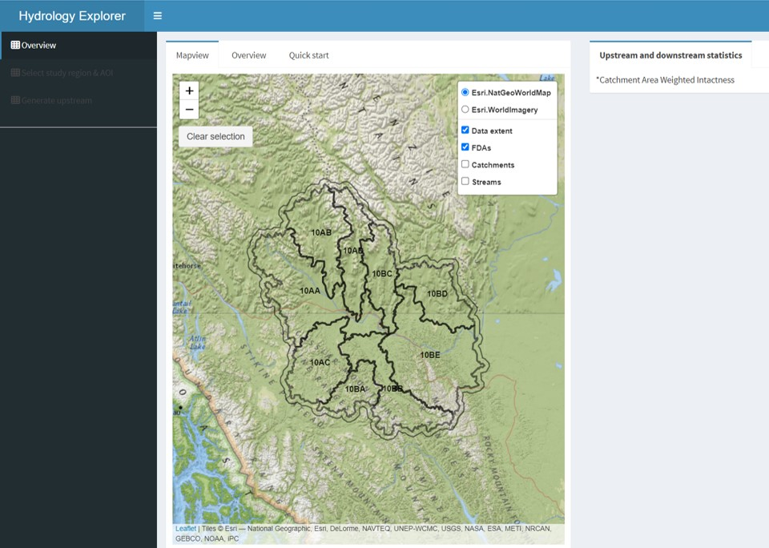

> ***To run the App, please select the Mapview tab above 

## Introduction

The Hydrology Explorer app uses the BEACONs catchments dataset as building blocks for identifying upstream and downstream areas of an area of interest and provide hydrological metrics on them. The user need first to identify a study area which is defined by the extent of an intactness layer by either selecting a FDA for which intactness and footprint maps have been pre-computed using disturbances buffered with 500m or by uploading the a .gpkg created by the Regional Disturbance Explorer app. The user can then specify the area of interest for which the upstream and downstream area will be computed by uploading a polygon of by interactively selecting catchments on the mapviewer.  also allows users to assess the influence of buffer size and minimum patch size on the resulting intactness and footprint maps. Currently, the app can only be used in the southeast Yukon.

  
     
    Figure 1. Shiny-based disturbance explorer app.
  

    
## Functionality
    
The app consists of three sections:
    
**Overview**:
    
- Provides a description of the app, its functionality, and the demo datasets.

**Select a study area and AOI**:

- Choose intactness map and study area from one of the two options:
  - Select an existing fundamental drainage area (disturbances buffere dwith 500m)
  - Upload a geopackage ('.gpkg') created by the Regional Disturbance Explorer. The extent of your study area will be defined as the extent of the intactness map found in the .gpkg.

- Choose Area of Interest (AOI) from one of the two options:
  - Upload your own polygon. Polygon must be provided as .gpkg. The projection must be EPSG:3579 (NAD83(CSRS) / Yukon Albers). Moreover, the polygon must overlay the study area.
  - Generate AOI by interactively selecting catchments within your study area
    

**Generate upstream and downstream**:
    
- View upstream, downstream and downstream stem area of your area of interest. Results are provided using the percent of intactness for each catchment. Hydrological metrics such as total areas of each component and mean of catchment area weighted intactness are provided in the adjacent table. 

- Download the results. The output is provided as .gpkg and it includes the following:
  - Boundary of the study area
  - Footprint map of the study area
  - Intactness map of the study area
  - Boundary of the area of interest
  - Catchments overlaying the study area
  
In the **catchments** layer, catchment intactness is provided using decimal (0-1) and the identification of each catchment to either upstream, downstream and downstream stem is provided using binomial value. 

## Input data
  
### Mapview
  
The key input data are:
- Intactness and footprint map generated by the Regional Disturbance Explorer, and
- Area of interest (can be uploaded or generated using a selected set of catchments)

Pre-compute intactness and footprint maps are provided within the tool. Those were generated at the FDA level using the disturbances buffered with 500m. The identification of the upstream and downstream catchments can only be computed across the FDA 10, which comprised 9 fundamental drainage areas (watersheds) located in the Yukon and British Columbia.

The identification of upstream and downstream catchment can't currently go beyond those wathersheds because of the extent of the catchment layer provided within the tool. 
 
