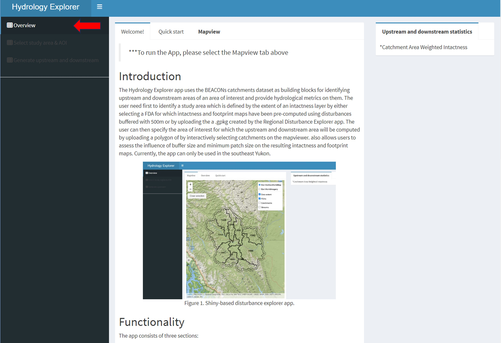
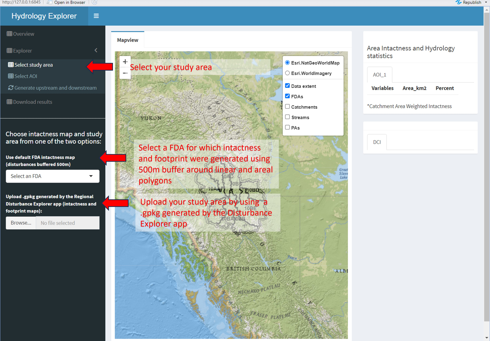
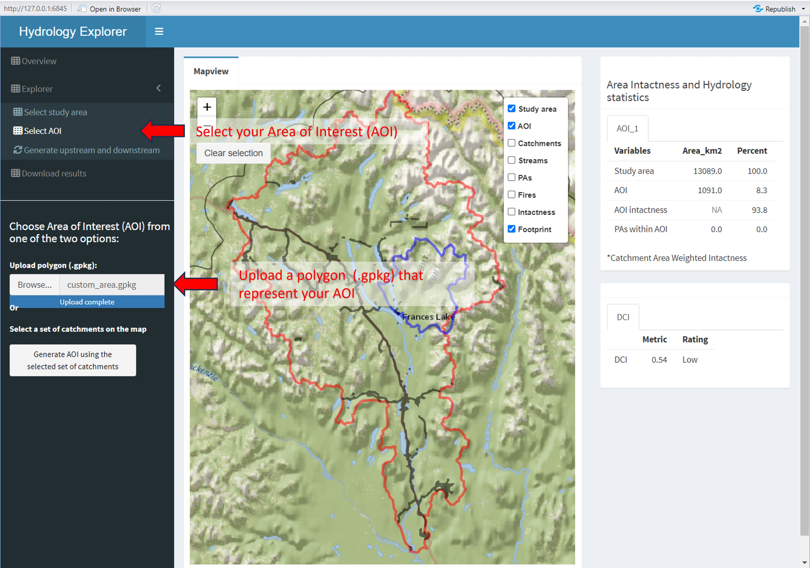
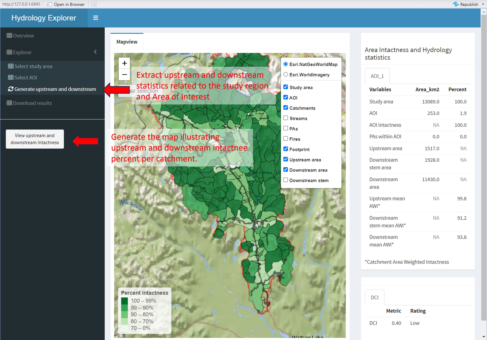
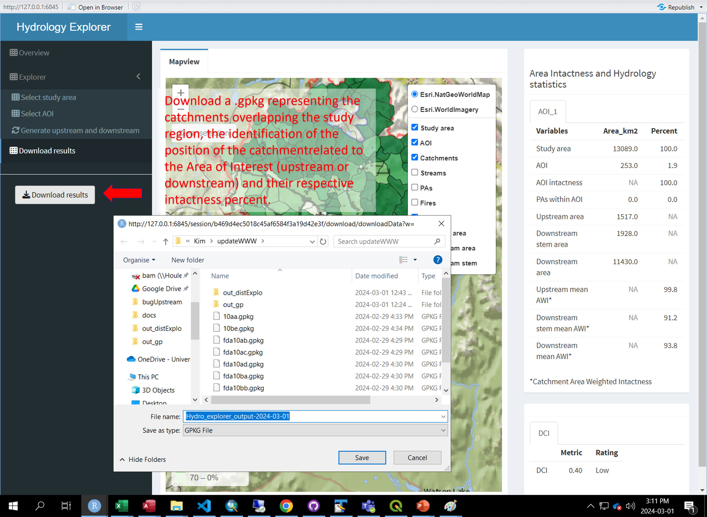

## Workflow

The purpose of the Hydrology Explorer app is to identify upstream and downstream areas of an area of interest and to provide hydrological metrics on them. This page provides a "quick start" to using the app by describing the main functions of the app. The worflow diagram below provides an overview of the process.

## Overview

The Overview section provides a description of the app and its functionality. You can start using the app by turning on and off the various layers in the map legend.

 Figure 1. Shiny-based hydrology explorer app.

## Select study region

Click on ***Select study area*** to first select the extent on which you want to perform the analysis. You have two choices:

  - Select an existing fundamental drainage area (FDA) to use the default intactness and footprint map that were generated using disturbances buffered with 500m. 
  - Upload a study area as a geopackage ('.gpkg'). 
  
If you upload a study area, the geopackage must be generated using the Disturbance Explorer app. 

 Figure 2. Select the study area.

After a few seconds to a minute, three new layers will appear in the map and legend: a ***study area*** layer, a ***footprint*** layer that shows the human influence on the landscape and an ***intactness***layer which shows the distribution of intact areas in the landscape.

## Select AOI

Then select your area of interest on which you want to evaluated the upstream and downstream area. You have two choices:
  - Upload a polygon as a geopackage ('.gpkg'). If you upload a polygon, the projection must be EPSG:3578 (NAD83(CSRS) / Yukon Albers). Moreover, in order to generate upstream and downstream area, the uploaded polygon must completely overlay the study area. The upstream and downstream area won't be computed beyond the extent of the data extent.
  

 Figure 3. Select the area of interest within your study area by uploading a polygon.

  
  - Select area of interest using the interactive catchments layer. You can either clear your entire selection by using the Clear selection button or by clicking again on the catchment you want to unselect. 

 Figure 4. Select the area of interest by selecting catchments.

After a few seconds, the map will display and zoom on the ***AOI*** layer and the area in squared km will be filled in the ***upstream and downstream statistics*** tab on the right sidebar. 

## Generate upstream and downstream

Click on ***View upstream and downstream intactness*** in the left sidebar to display the upstream and downstream area and compute the statistics on intactness.

 Figure 5. View upstream and downstream area.

Once it is done, the map and legend will add three layers: an ***upstream area*** layer that represent upstream catchments of the area of interest, a ***downstream area*** layer for catchment that are downstream the area of interest and a ***downstream stem*** layer that represent the downstream flow. The ***upstream and downstream statistics*** tab on the right sidebar will be updated in order to provide the numbers related to the area of interest selected.  

## Download results

Results can then be downloaded as a geopackage which will include:

      - Extent of the area of interest (aoi)
      - Catchments overlaying the study area (catchments)
      - Fires overlaying the study area (fires)
      - Footprint map of the study area (footprint)
      - Intactness map of the study area (intactness)
      - Protected areas overlaying the study area (protected_areas)
      - Extent of the study area (studyarea)

  

 Figure 6. Download the data as geopackage.

The geopackage can be further viewed and analysed in a GIS e.g., QGIS. In the **catchments** layer, catchment intactness is provided using decimal (0-1) and the identification of each catchment to either upstream, downstream and downstream stem is provided using binomial value. 
